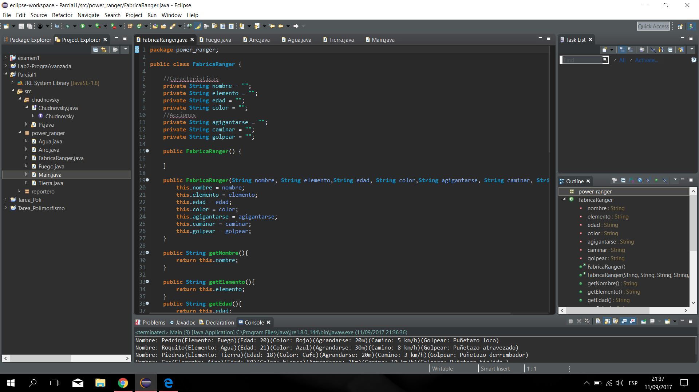
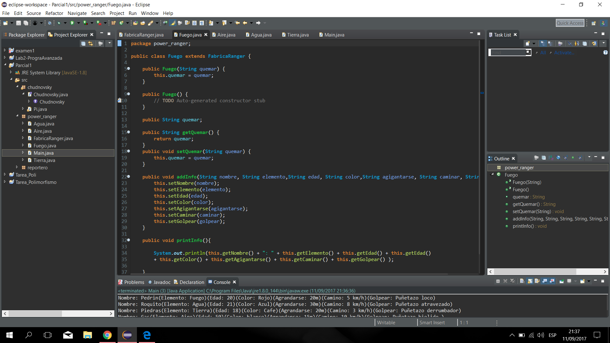
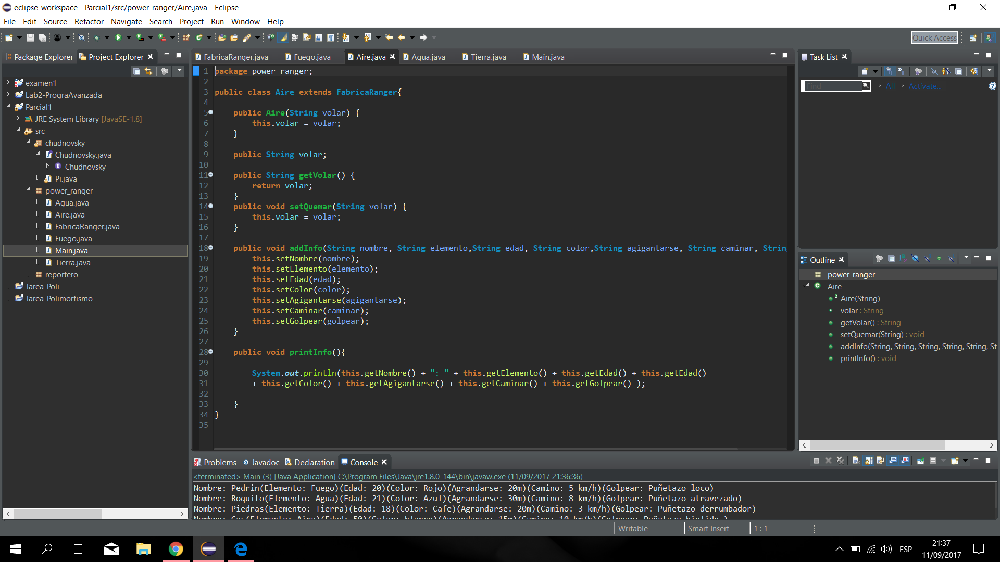
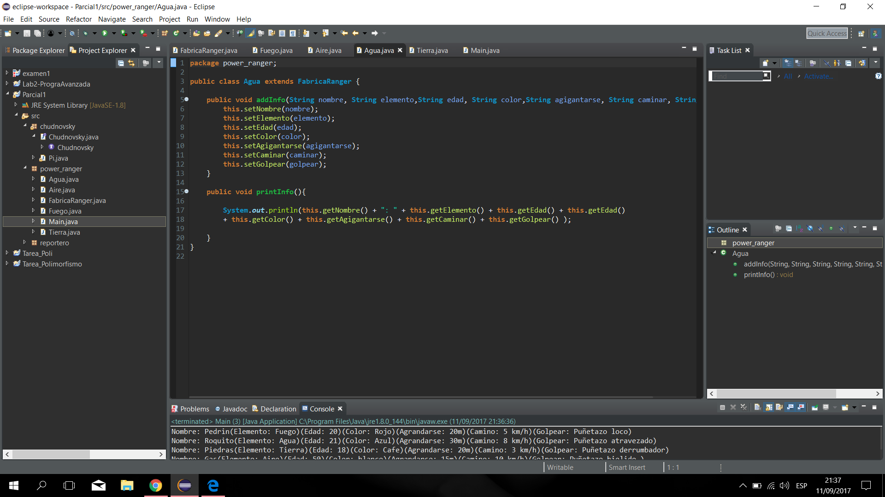
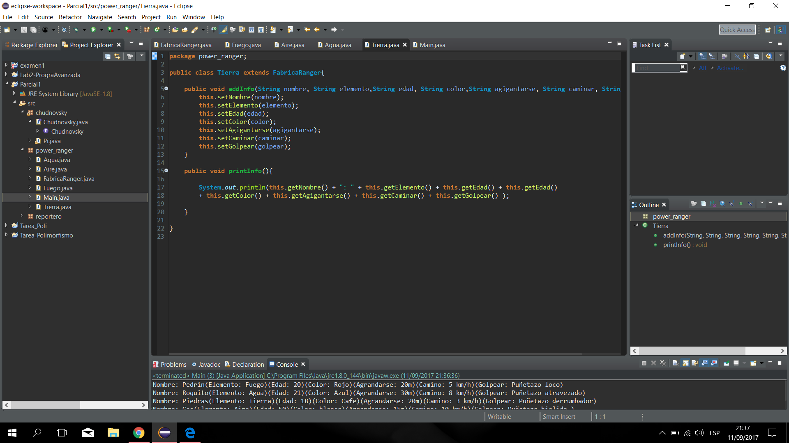
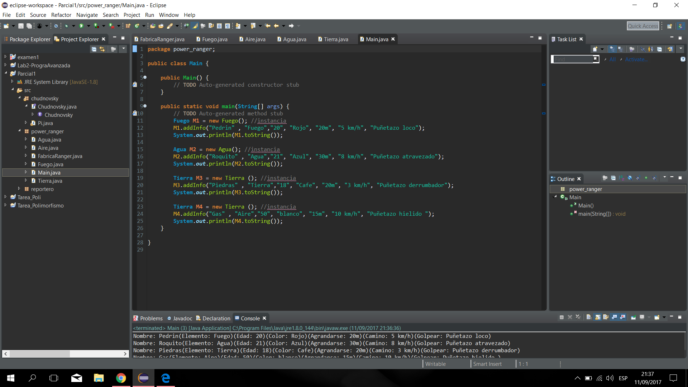

# Primer_Parcial

### Carlos Andrés Cuéllar Velásquez 2497117

## a) Chudnovsky

 
 ## b) Reportero
 
 
 
 ## c) Power Ranger
 
 1. Crear la clase FabricaRanger

   1.1 Esta sera la clase padre que heredara a las demas clases.
   
   1.2 Se declaran todos los atributos que debe tener un monstruo de la serie Power Ranger.
   
   1.3 Se hace un get y set de los atributos del monstruo. 
   
   1.4 Se hace un toString que englobe todos los atributos en una cadena alfanumerica.

 

 
2. Crear la clase Fuego

    2.1 Se define que heredara los atributos de la clase FabricaRanger 

    2.2 Se crea los atributos propios de la clase fuego, que seria quemar. 

    2.3 Se hace el constructor que obtendra todos los atributos del monstruo. 

 
 
3. Crear la clase Aire

    3.1 Se define que heredara los atributos de la clase FabricaRanger 
    
    3.2 Se crea los atributos propios de la clase Aire, que seria volar. 

    3.3 Se hace el constructor que obtendra todos los atributos del monstruo. 

 
 
 
4. Crear la clase Agua

    4.1 Se define que heredara los atributos de la clase FabricaRanger 
    
    4.2 Se hace el constructor que obtendra todos los atributos del monstruo. 

 
 
 4. Crear la clase Tierra

    4.1 Se define que heredara los atributos de la clase FabricaRanger 
    
    4.2 Se hace el constructor que obtendra todos los atributos del monstruo. 

 

5. Crear la clase Main

    5.1 Se crean las instancias

    5.2 Se le da valores a los parametros para darle todos los atributos. 

    5.3 Se imprimen llamando al metodo ToString, ejemplo: System.out.println("nombre del objeto".toString());
 
 
